# Call Graphs

Proper functional decomposition in program code is not an easy task, especially when one is new to programming.

A call graph shows which functions call which other ones. Below is a simple program and its call graph: `main` calls
`a` and `b`, and function `a` calls `b`.

```c
void b() {
}

void a() {
    b();
}

int main() {
    a();
    b();
}
```

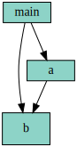

Such graphs can give us a quick overview of how a program works. It can also uncover various issues with its design. For students'
assignments (mini-projects), we use these graphs to find:

- Improper use of function calls, abusing function calls to implement `goto`.
- Problems with functional decomposition, code duplication.
- Some memory management problems.

### Call Graph Generator

The PHP program hosted in this repository can draw the function call graphs for C and C++ sources via static analysis of the
source code, with the help of GCC/G++. Usage is:

```
php callgraph.php <inputfiles...> [output.svg]
```

Filenames are: `*.c`, `*.cpp` (compile), `*.expand` (use as-is) and one `output.svg`.
File types are determined by the extension.

Required helper applications are `gcc` (and `g++` if you use C++); `c++filt` for function
name demangling, `dot` (graphviz) for drawing.

The analyzer uses static analysis. The code is not executed, rather the source code is processed. Edges
on the graph point *from the caller to the callee*. In case of indirect function calls, the source vertex of the
dashed edge is the function *taking the address* the callee, not the one that actually calls it. As the address of the
function can be stored in a variable, it would be impossible to find the real caller.

The height of the boxes is proportional to the complexity of the function. More precisely, it is proportional to the
square root of the amount of code generated, because this way generated images are clean, yet informative.

### Limitations

The function call graph is exported from an internal representation of the compiled code using GCC, namely the RTL
data structures (register transfer language). To generate this output, the code must be compiled.

- The graph cannot show static functions correctly, as RTL output contains no linkage information. This is only problematic
  if two source files contain two static functions with the same name.

- Global pointers initialized with function pointers do not show up on the graph, as the RTL contains no corresponding
  code line.


## Spotting problems on the graph

Ideally, the graph resembles a tree. It has multiple levels, but it is sparse; with proper functional decomposition,
there is little dependency between the blocks (except for some library calls).

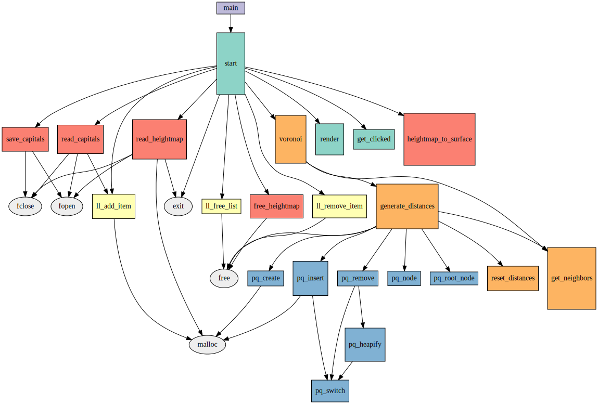

### Using functions as `goto`

Beginners sometimes do not have the proper mental model of functions, and use them as `goto`.

Consider a simple a phone book
application written for the console:

```
Phone Book

1. New entry
2. Find by name
...
0. Save & Exit
```

 `menu()` might call `new_data()`, then `new_data()` might call back `menu()`,
instead of just returning. Then `menu()` calls `find_phone_number()` and `find_by_name()` calls `menu()` again,
and so on. Clearly, a loop is missing in `menu()`, and the student substituted it with calling
`menu()` from all the other functions.

This kind of problem will show up as a cycle in the graph. The analyzer will find all the cycles, and will draw the
relevant edges with red. Usually one of the functions in the cycle will have an edge to the standard library
`exit()` function, otherwise it would be impossible to terminate the infinite series of recursive calls. This is
why `exit()` is always shown on the graph.

The figure below shows a typical example. Presumably this is a multi-level menu system, with each menu function having the same problem outlined above.

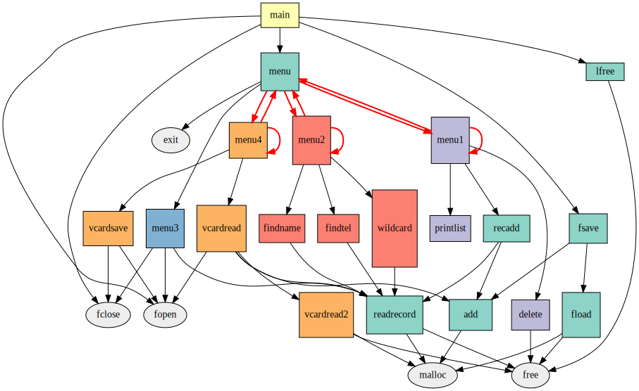

This problem might appear in several parts of the same program, sometimes even `main()` is called - which really should not have
an inbound edge:

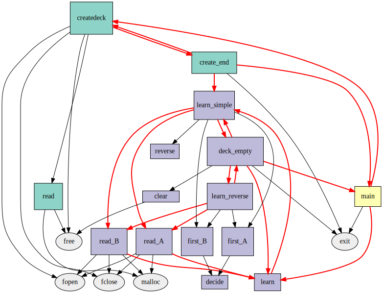

Loops and cycles are not necessarily problematic. The next example shows a Minesweeper application, in which the
`reveal()` call will find all empty cells adjacent to a starting point. This is the well-known flood fill algorithm.
The name of the function will tell whether the code itself is worth examining:

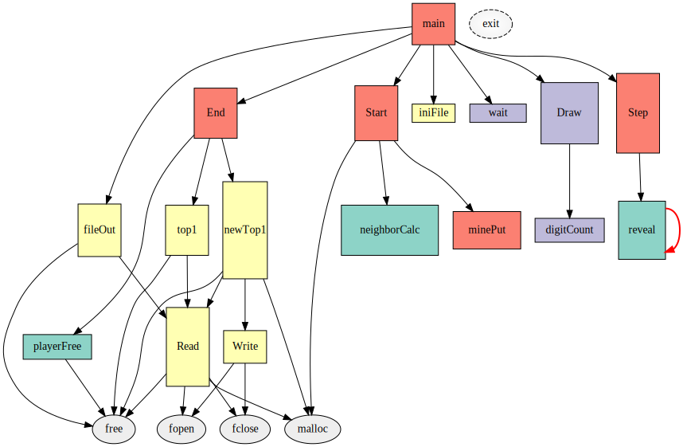


### Functional decomposition and modules

A function with too many outbound edges suggests problems with functional decomposition in the application.
Usually the problematic function is `main()`. The graph below shows an application in which most of the logic
is implemented in the `main()` function. The size suggests the same:

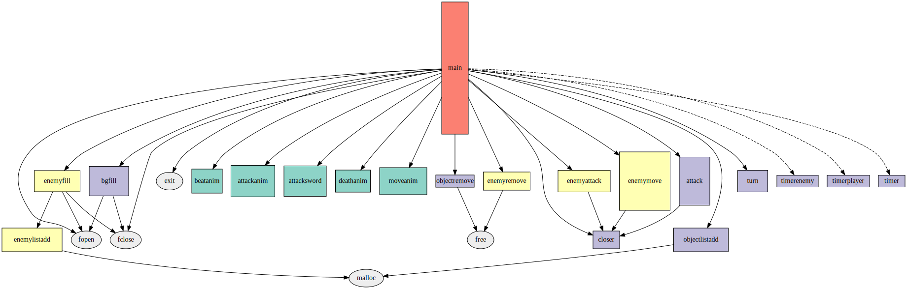

It's nice that the application below uses indirect function calls for the menu. One can guess that function
pointers are stored in an array. However, the functions `oneplayer()` and `twoplayer()` certainly have a
lot of code duplication, all their outbound edges lead to the game implementation functions symmetrically.
Collision detection is also implemented twice, in `headHit()` and `headHit_multi()`. The same with
the user interface: `drawSnake()` and `drawSnake_multi()` must be copy-pasted. Why are there two functions?
Why was it impossible to call one draw function twice with each snake as an argument? Perhaps the arguments are missing
altogether; that would be the first thing to examine in the code.

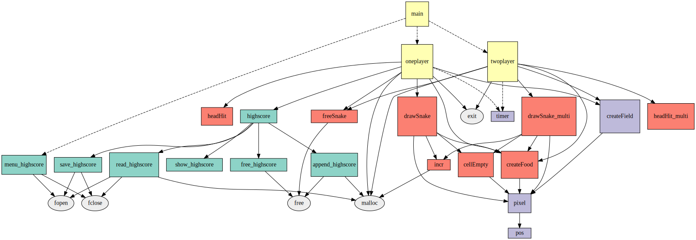

The graph generated by the analyzer will show functions with color. The color represents the module
(source file) which defines the function. Too many colors suggest that modularizing is overdone.
The Conway's Game of Life implementation below has a separate source file for each function (except
for the memory management part). Also it is interesting to note that `ffield_read()` does not call
`field_init()`. Why is that different from `field_malloc()`, which is presumably used to allocate
memory for the grid? The code is probably also duplicated here and there, as `field_file()` outbound
edges and `new_field()` outbound edges lead to the same functions.

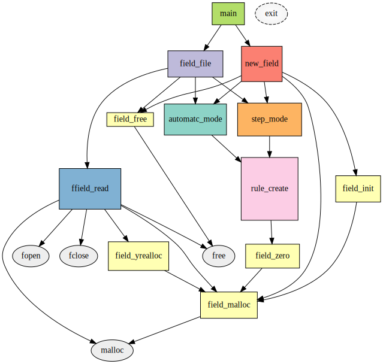

Unicolor graphs are suspicious. Perhaps the whole project is one source file. Or the `#include` feature
might be used incorrectly, ie. `*.c` source files are `#include`-d. (In this case, the preprocessor has
inserted the file contents, so the compiler won't see the original modules.) Sometimes header files contain
function definitions:

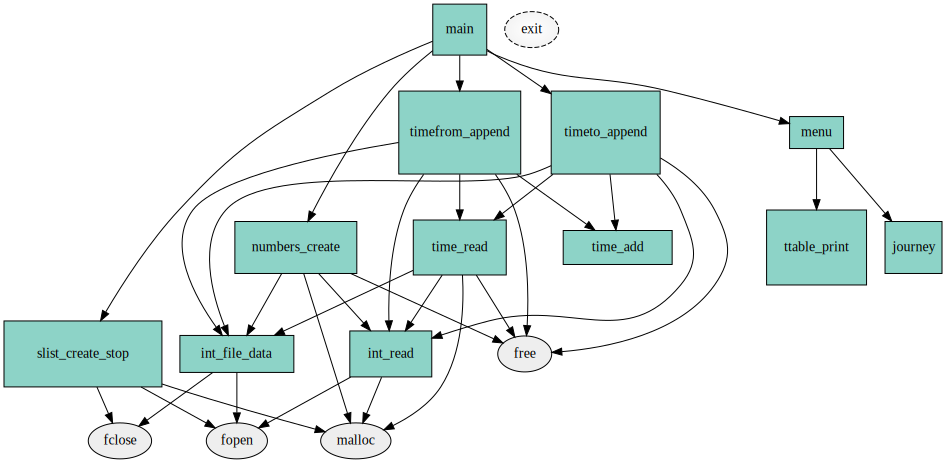

### Resource management

Data structures and pointers are also a complex topic. Beginners sometimes try to circumvent data structure implementation, and store all
data in files. When adding an entry to the phone book, a new data line is appended to the file. When an entry is deleted, all data 
lines are copied to a temporary file, while omitting the entry to be deleted. Sometimes there is a proper data structure in memory, 
but all operations also refresh the file, and there is no separate `save_all_data_to_file()` function. Problems like this are quite apparent on the graph: the standard library functions `fopen()` and `fclose()` have a lot of inbound edges (calls):

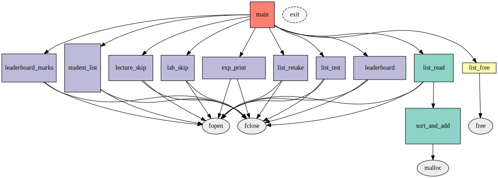

It's also easy to see when the application has no dynamic memory management or file handling. Just check if the `malloc()-free()`
or the `fopen()-fclose()` functions have calls:

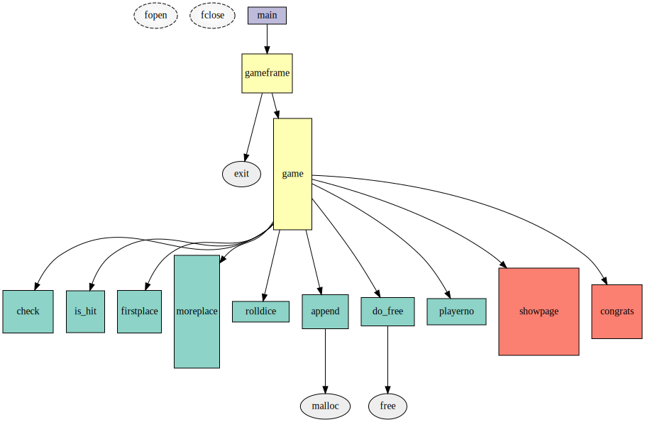

The application below is certainly leaking memory, there is not a single call to `free()`. Anyway, the data structure built
with `malloc()` must be very simple as well: only `main()` calls `malloc()`, and this `main()` function that is shorter than
the `menu()`:

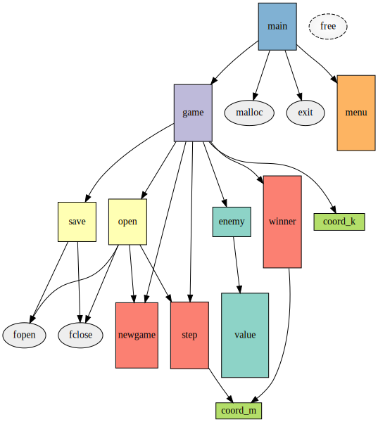

The next example also suggests memory leaks. A lot of inbound edges to `malloc()`, but a very few to `free()`. And those few
inbound links start from file reader functions - why would it be necessary to free memory in a function, which is supposed to read
data and build some data structure?

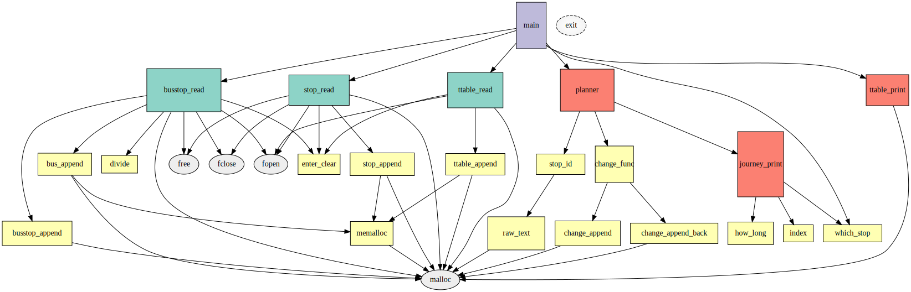

Files that are not closed also contribute to resource leaks. The inbound edges for `fopen()` and `fclose()` do not match
in the next example. The `highscore_print()` function opens a file, but does not close it. OK, the `FILE*` pointer could have
been returned, maybe stored in a variable, but this is quite unlikely, the names of other functions suggest otherwise:

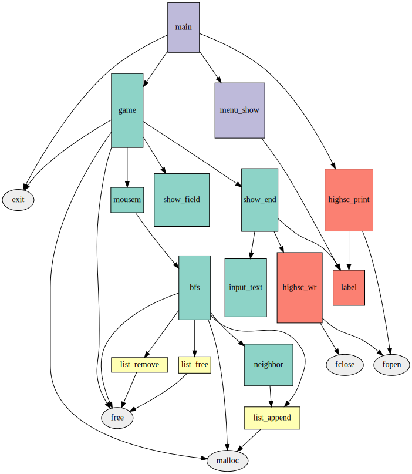

### Other considerations

This application is quite small. One can judge the size by checking the boxes. `main()` must be a god-function, much longer than the others.

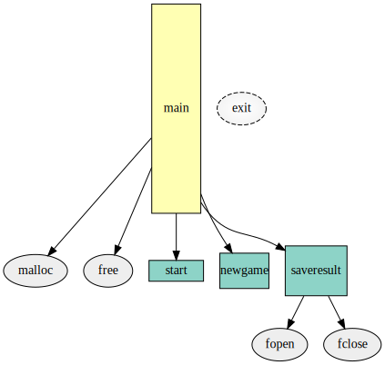

This project is unfinished, or under some refactoring. Several functions are not called at all. Bigger projects always contain
dead code, but not to this extent:

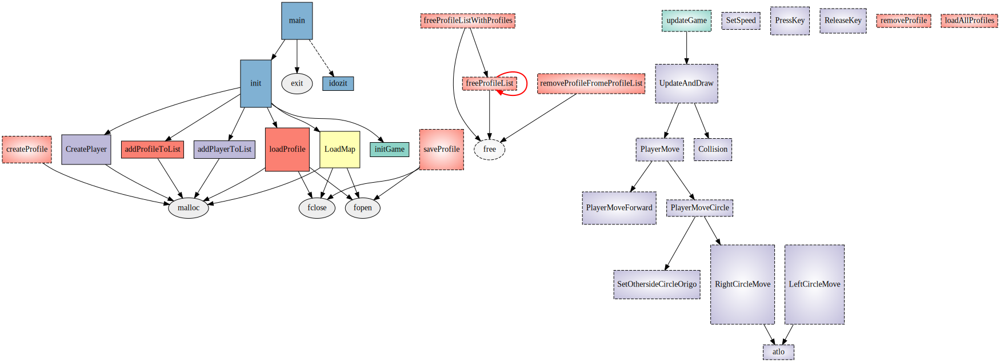

